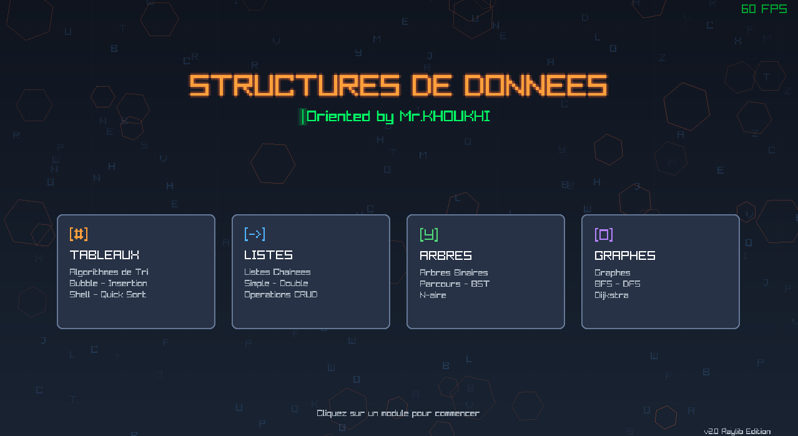
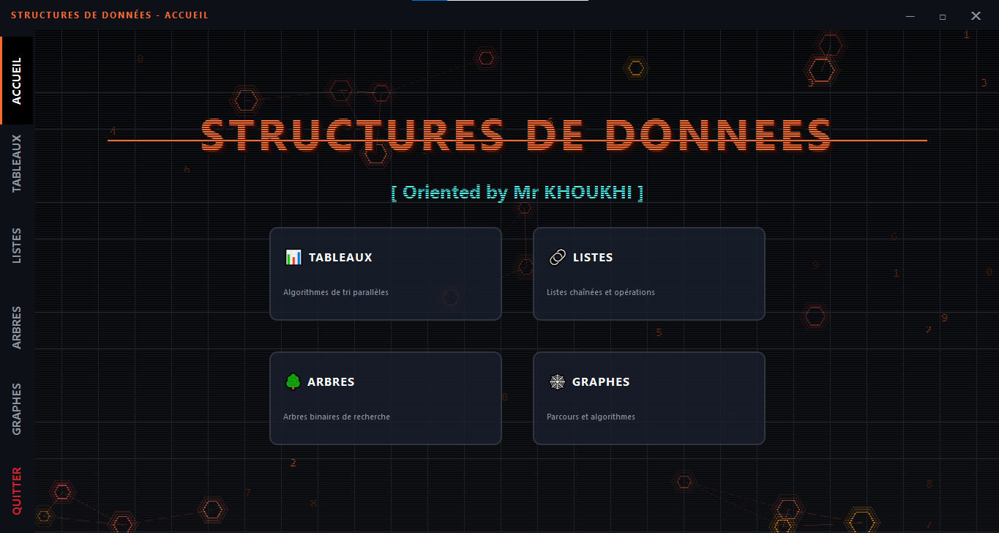
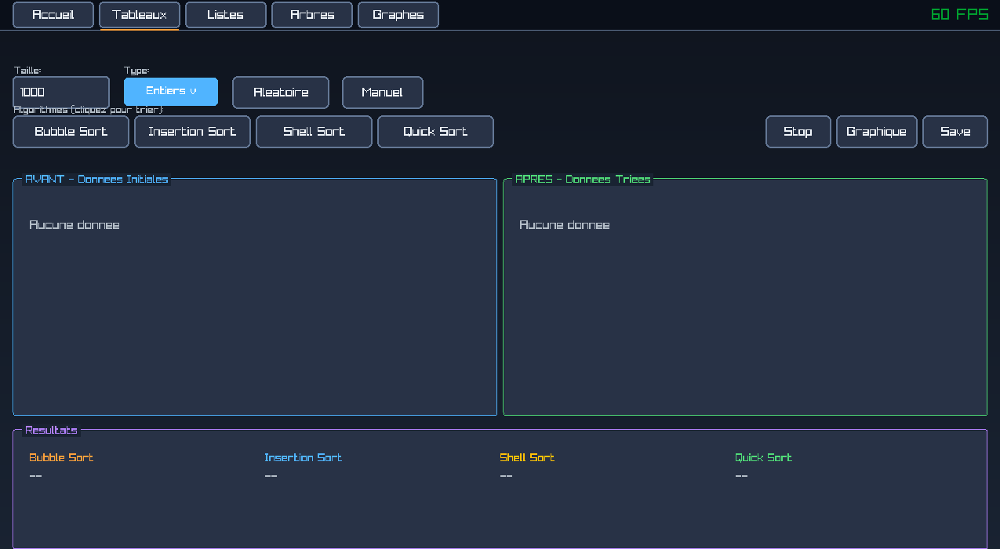
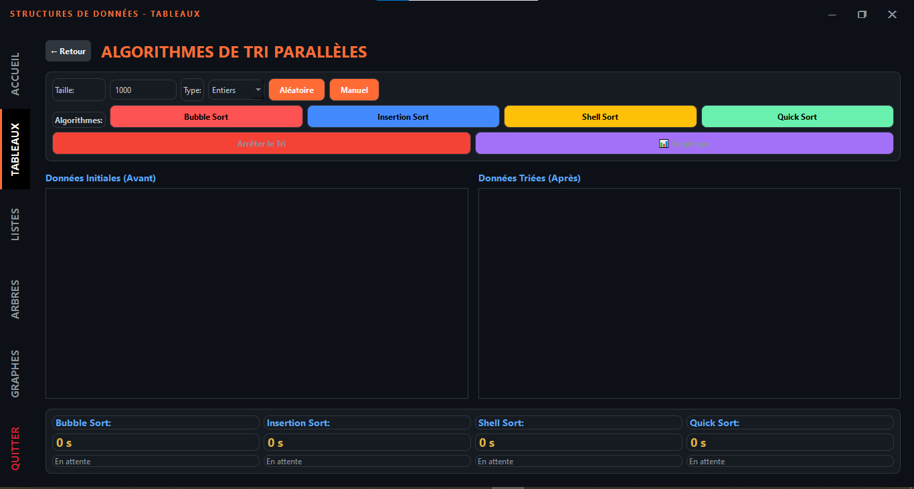
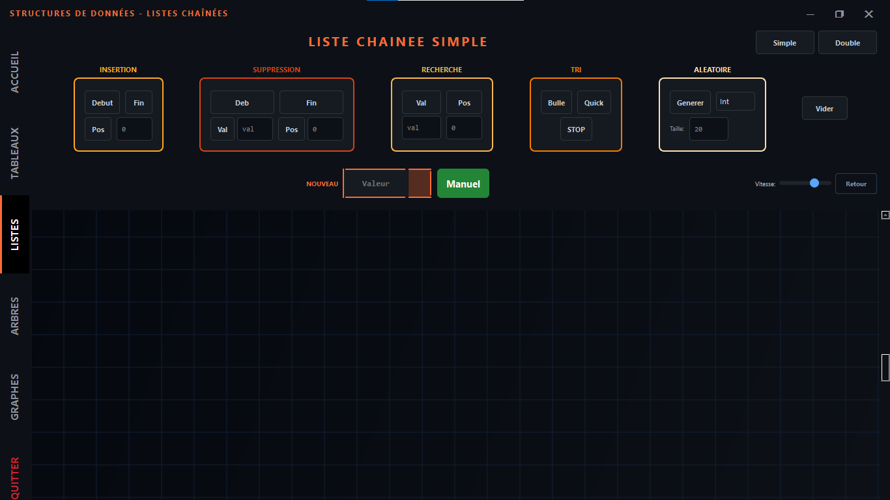
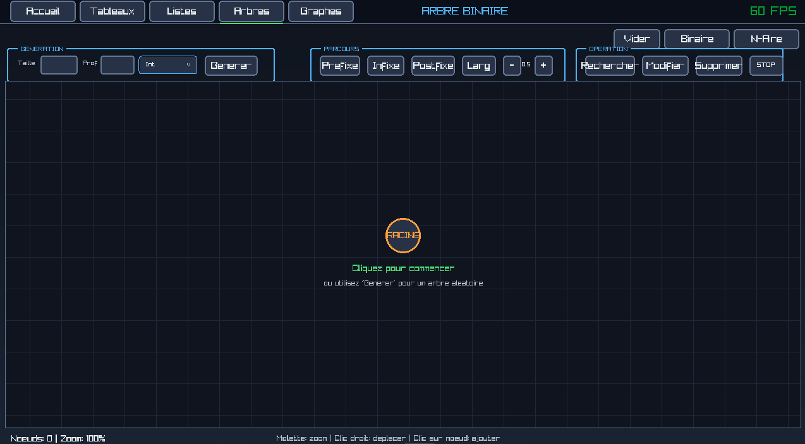
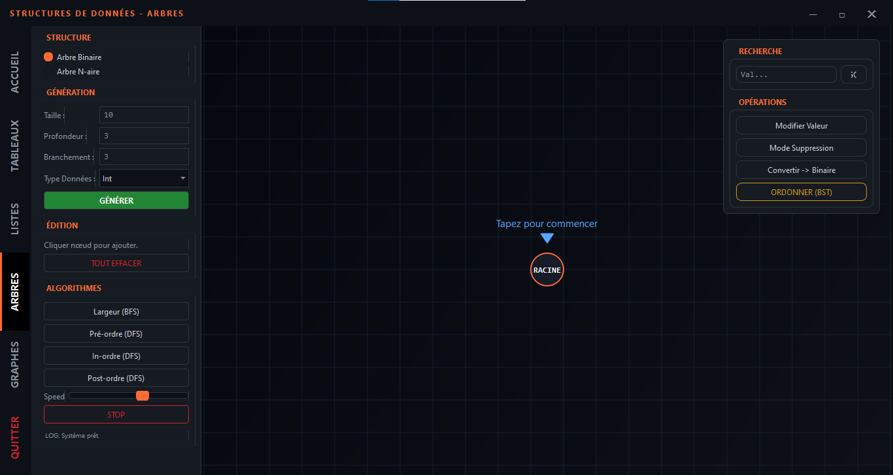
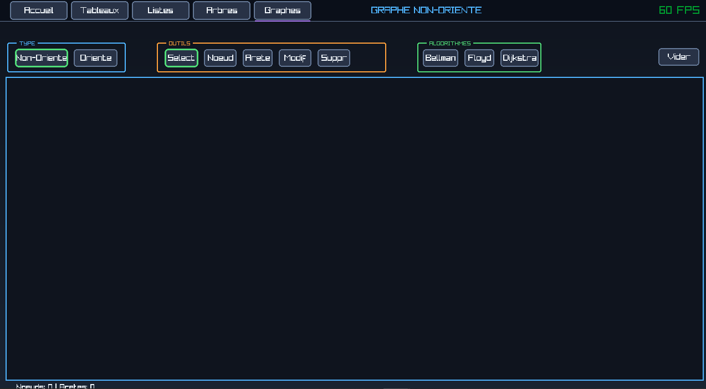
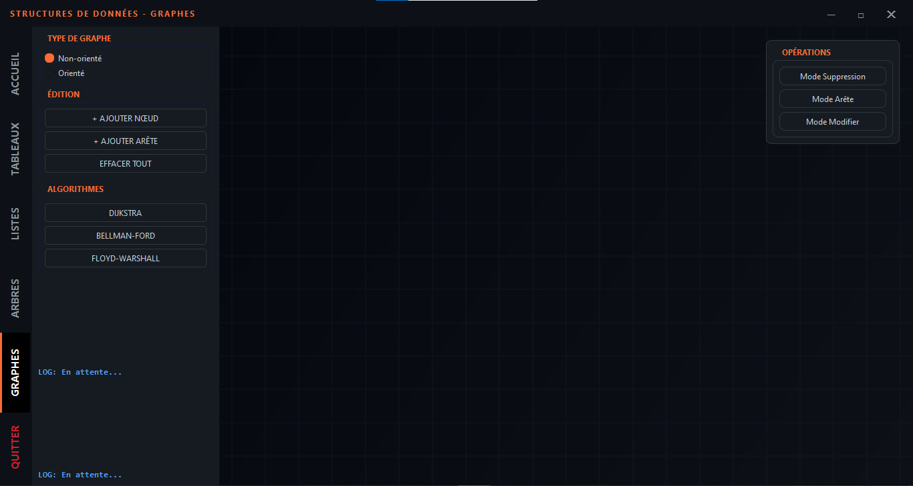

# 🎓 Structures de Données - Visualisation Interactive

Application éducative de visualisation des structures de données fondamentales en informatique.


---

## 📋 Description

Ce projet propose une **double implémentation** d'un outil pédagogique de visualisation :
- **Version C** avec la bibliothèque graphique **Raylib**
- **Version Python** avec **PySide6 (Qt6)**

---

## 🖥️ Captures d'écran

### Accueil
| Version C | Version Python |
|-----------|----------------|
|  |  |

### Tableaux
| Version C | Version Python |
|-----------|----------------|
|  |  |

### Listes Chaînées
| Version C | Version Python |
|-----------|----------------|
|  |  |

### Arbres
| Version C | Version Python |
|-----------|----------------|
|  |  |

### Graphes
| Version C | Version Python |
|-----------|----------------|
|  |  |

---

## 🎯 Fonctionnalités

| Module | Fonctionnalités |
|--------|-----------------|
| **Tableaux** | Bubble, Insertion, Shell, Quick Sort + Comparaison |
| **Listes** | Simple/Double, Insertion, Suppression, Recherche, Tri |
| **Arbres** | Binaire/N-aire, Parcours, BST, Conversion |
| **Graphes** | Dijkstra, Bellman-Ford, Floyd-Warshall |

---

## 📥 Téléchargement

➡️ **[Releases](https://github.com/ErRafiyTA/App-Data-Structure/releases)**

| Version | Compatibilité |
|---------|---------------|
| **Version_C.zip** | Windows 7 / 8 / 10 / 11 |
| **Version_Python.zip** | Windows 10 / 11 |

---

## 🚀 Compilation

```bash
# Version C
make

# Version Python
pip install PySide6 matplotlib numpy
python main_pyqt.py
```

---

## 📖 Contexte

Projet réalisé dans le cadre du module **Structures de Données**.

**Encadré par** : Mr. KHOUKHI

---

## 📝 License

MIT License - Copyright (c) 2024-2025 TAHA AMINE ER-RAFIY

---

## 👤 Auteur

**TAHA AMINE ER-RAFIY**

[](https://linkedin.com/in/taha-amine-er-rafiy)
[](https://github.com/ErRafiyTA)
